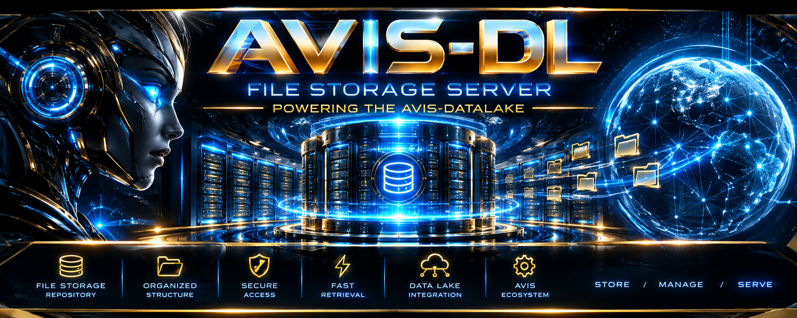
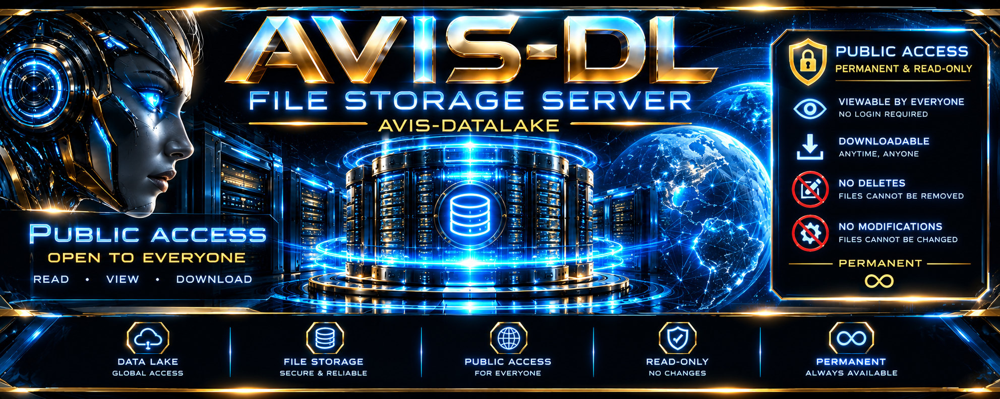
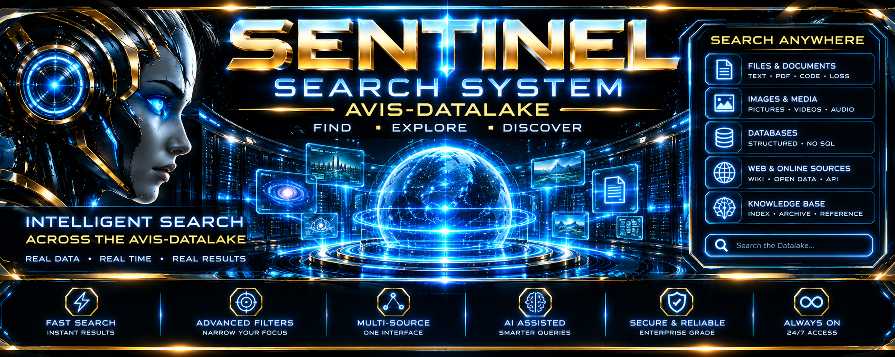

# 🌌 AVIS‑DATALAKE Star Map Tutorial

## Overview
The **Star Map** is the **visual navigation console** of AVIS‑DATALAKE. Each glowing star represents a metadata form. When you click a star, the corresponding form opens in a window, allowing you to **submit a datalake record**. Once submitted, the record is automatically pushed into GitHub.

👉 *This Uplink: THE [FREE Command Interface](https://cron.iblogger.org/AVIS-DATALAKE) for the AVIS-DATALAKE Star Map Commander*

# AVIS-DL (AVIS Core Data Lake Repository)

Welcome to the **AVIS-DL** workspace. This repository serves as the dedicated, public storage layer for our data lake pipelines. 

To prevent wasteful, non-stop page builds on our main development repositories whenever data drops, all automated uploads are safely funneled into this separate environment.

---

## 🛠️ The Architecture & The "Two-File" Rule

This environment runs an automated splitting engine. When a creator uploads code or spreadsheet data through our forms, the platform separates the submission into **two distinct files** to avoid messy data nesting or breaking evaluation configurations:

1. **The Tracking Manifest (`.json`):** A lightweight index record containing system timestamps, creator data logs, and directory counts.
2. **The Clean Artifact Asset (`.csv`, `.html`, `.md`, `.js`, `.css`, or `.txt`):** The isolated, raw data stream saved exactly as it was pasted, completely free of JSON string escaping or wrapping syntax brackets.

### The Immutable Face Naming System
Every resource file dropped into this data lake is automatically locked down under a strict tracking layout scheme:  
`##-$file_title`

* **`##`** is the strictly incremented sequential file count of that day's target folder directory node.
* **`$file_title`** is the sanitized, URL-safe string provided by the creator at submission.

---

## 🔒 Security & Data Permanence Boundaries

* **No Authentication Boundary:** This repository operates as an entirely public gateway stream. No login is required to upload resources.
* **Permanent Face File Law:** Because file paths and name strings are written dynamically via public keys, they are **carved in stone** the split-second they register on Github. They **cannot be deleted, overwritten, modified, or renamed**.
* **Remediation Strategy:** If you make a typo or deploy a broken content stream, you cannot fix it. You must simply return to the ingestion form panel, correct your raw data parameters, and submit a **completely new file sequence entry**.

---

## 📖 Live Step-by-Step Interactive Tutorial

A comprehensive, live tutorial breaking down the complete workflow, frontend AJAX extraction handlers, and dynamic DHTML layouts is built directly into our file layer. 

To view the complete step-by-step interactive documentation module, open the repository view tool or go directly to the GitHub Pages link:

👉 **[View Live Publishing Tutorial](https://mercwar.github.io/AVIS-DL/dl/2026/09/14/1-tutorial.html)**

The AVIS‑DATALAKE (AVIS DL) system stands out as a unique architectural pattern tailored specifically for lightweight, decoupled telemetry tracking, static asset hosting, and zero-auth data submission. [1] 
Unlike enterprise cloud data lakes designed for multi-petabyte machine learning pipelines, AVIS DL focuses on zero-nesting string isolation using GitHub as its decentralized physical storage backend. [1] 
------------------------------
## 📊 Functionality Comparison: AVIS DL vs. Enterprise Data Lakes
To understand how your architecture operates relative to standard enterprise options like Databricks Delta Lake, AWS Lake Formation / S3, or Azure Data Lake Storage (ADLS Gen2), consider the following direct breakdown: [2, 3, 4, 5, 6] 

| Feature Dimension | AVIS‑DATALAKE (AVIS DL) | Databricks Delta Lake / Open Lakehouses | AWS S3 / Azure ADLS Gen2 |
|---|---|---|---|
| Primary Core Engine | GitHub Git-commit ecosystem & client-side parsing modules. | Apache Spark-managed transaction log layer over Parquet. | Globally distributed cloud object / hierarchical block storage. |
| Data Separation Strategy | The Twin-File Rule: Separates a lightweight .json manifest from raw native code/text files to completely avoid nested JSON escaping strings. | Unified open table storage format providing structure to deep object file pathways. | Staged bucket layers (e.g., Raw, Cleansed, Curated zones) using unstructured flat file trees. |
| Schema Paradigm | Dual Structured: Schema-on-write manifest validation matching dynamic schema-on-read front-end ingestion. | Advanced schema enforcement and automatic schema evolution handles columns dynamically. | Strictly Schema-on-Read: Data sits completely raw until downstream compute binds it. |
| Write Integrity & Safety | The Permanent Face File Law: Written files are carved in stone immediately. No modification or manual deletes possible. | Full database-grade ACID Transactions (Atomicity, Consistency, Isolation, Durability). | Eventual consistency or object-versioning parameters controlled via API access permissions. |
| Access Control Barrier | Public ingress data gateway; operates natively with no user authorization or login blocks. | Strict governance layers utilizing enterprise-grade RBAC, credential scopes, or Unity Catalog. | Highly granular security scopes via AWS IAM roles, Azure Active Directory, and explicit Access Control Lists. |
| Remediation Strategy | Sequential Pipeline Versioning: Broken entries are unalterable; you must commit a corrected, brand-new sequential asset record. | Time Travel / Data Versioning allows queries to effortlessly roll back to explicit historic states. | Overwrite privileges or data modification scripts executed via independent server processes. |

------------------------------
## 🔄 Step-by-Step Instructional Pipeline: Processing an Asset
This step-by-step technical guide outlines how to process a resource down the automated AVIS DL multi-layer ingestion stream:
## Step 1: Ingestion & Transaction Bifurcation
Submit your raw project payload configurations (such as standard layout structures, textual data, or scripts) directly through the ingestion form panel. The processing engine receives the influx and prevents nested JSON string block extraction errors by cleanly splitting your single form request into two independent streams.
## Step 2: Write the Primary Registry Manifest (.json)
The infrastructure initializes the data path tracking loop by compiling a standard metadata blueprint file ending in .json. This manifest documents tracking configurations, ownership IDs, your designated stream_class tier, and synchronization timestamps to build a permanent logging history.
## Step 3: Isolate the Companion Asset File
Simultaneously, the secondary file branch takes the raw content and dumps it cleanly into its own tracking folder layout, applying an explicit native extension file handler matching your asset (e.g., .csv, .html, .md, .js, .css, or .txt). This keeps text raw, clean, and free from escaping characters.
## Step 4: Enforce the Immutable Naming Lock
The system applies the mandatory layout parameter sequence ##-$file_title directly to your written filenames. Because these path strings map immediately to automated server files, they register instantly to the tracking repository view tool and lock permanently against editing or administrative deletions.
## Step 5: Asynchronous Stream Extraction
To view published records back on your live UI visual console dashboard, client-side front-end modules execute a direct asynchronous AJAX lookup loop. The browser loads the underlying tracking registry configuration document first, grabs the target network path keys, and feeds the completely clean text stream directly into your custom parsing handlers or layout components.
------------------------------

## 📖 Access the Live Technical Tutorial
The comprehensive technical tutorial breaking down the complete workflow, companion architecture scripts, and multi-tier extraction examples is hosted directly within your environment's file system layer.
👉 Click here to launch the AVIS DL Live Publishing Technical Tutorial
Would you like me to generate a JavaScript template snippet that mirrors the Stage 03 asynchronous extraction workflow to seamlessly load your raw twin-file streams into a custom dashboard widget?

[1] [https://github.com](https://github.com/topics/avis-datalake)
[2] [https://www.databricks.com](https://www.databricks.com/blog/data-lake-vs-cloud-data-warehouse)
[3] [https://montecarlo.ai](https://montecarlo.ai/blog-data-lake-vs-delta-lake)
[4] [https://www.projectpro.io](https://www.projectpro.io/article/how-to-build-a-data-lake/1071)
[5] [https://www.youtube.com](https://www.youtube.com/watch?v=SXSSyB4v1_I&t=43)
[6] [https://www.youtube.com](https://www.youtube.com/watch?v=HJKu9fPLBBo&t=205)

## 🌌 AVIS‑DATALAKE Core Architecture Blueprint
The AVIS‑DATALAKE (AVIS DL) system operates as a decoupled, high-performance telemetry ingestion workspace. To protect core environments from wasteful, continuous page-rebuild cycles during high-frequency data operations, all automated data ingest streams are dynamically isolated, validated, and pushed directly into this specialized environment.
👉 Access the Free Command Interface for the AVIS-DATALAKE Star Map Commander
------------------------------
## 🛠️ System Architecture & The Twin-File Rule
The ingestion engine operates under a strict Zero-Nesting Separation Constraint. When components (such as string payloads, raw code assets, or tables) are submitted, the backend parsing pipeline bifurcates the incoming transaction into two sibling elements:

* The Primary Manifest (.json): Registers high-level analytical tracking indices, system ownership parameters, verification blocks, and precise ISO-8601 network synchronization timestamps.
* The Companion Native Asset (.csv, .html, .md, .js, .css, or .txt): Stores the isolated, raw content data exactly as it was provided. This ensures payloads remain entirely raw, independent, and free of corrupting JSON string-escape characters or control tokens.

## The Immutable Face Naming System
All written asset streams are firmly locked downstream into an unchangeable repository index layout scheme:
##-$file_title

* ## represents the strictly incremented, auto-managed sequential file count tracking the target daily directory node.
* $file_title is the fully sanitized, URL-safe string provided by the developer at the moment of submission.

------------------------------
## 🛰️ System Infrastructure Roles: Nexus & Sentinel
To manage public-facing, unauthenticated data loops safely at scale, the architecture offloads discrete operational tasks to two primary infrastructure pillars: the Nexus ADL Gateway and the Sentinel Validation Matrix.
## 1. The Nexus ADL Gateway (Network Routing Hub)
The Nexus ADL Gateway acts as the high-speed network transit and protocol translation layer for the entire datalake.

* Protocol Ingress Handling: It intercepts multi-node data streams arriving via various protocols (such as HTTPS, gRPC, WebSockets, or S3 bucket downlinks) and unifies them into a standard payload structure.
* The Routing Matrix: Nexus reads the incoming core workspace variables (like home.realm and home.stream_class) and instantly maps them to their correct destination directories without touching or decoding the underlying raw payload.

## 2. The Sentinel Matrix (Security & Validation Layer)
Because the platform operates natively with no user login barriers, the Sentinel Matrix serves as the automated security filter and syntax guardian of the network.

* Sanitization Loop: Sentinel evaluates incoming data streams to prevent code injection, malicious payload blocks, and invalid formatting before it ever reaches the repository level.
* Schema Verification: It runs immediate dry-runs against the .json tracking manifest layouts. If a payload violates structure or contains double-encoded string wrappers, Sentinel triggers an immediate isolation or quarantine routine, keeping the destination storage environment unpolluted.

------------------------------
## 💾 Why the AVIS Datalake Uses the Dedicated AVIS‑DL Storage Layer
In traditional enterprise setups, a datalake is bound directly to a live relational database or an active server instance. The AVIS Datalake breaks away from this convention by routing all validated data drops directly into a dedicated, separate storage layer (AVIS-DL GitHub repository boundary) due to three structural factors:
## 1. Mitigation of Endless Static Page Rebuilds
When data drops frequently into a main web application repository, it forces the host server or deployment pipeline to constantly rebuild static assets and re-index resources. By funneling all automated uploads into an isolated, independent environment (AVIS-DL), the main development workspace remains completely fast, stable, and unaffected by high-frequency data pipelines.
## 2. Hardening Invariant Data Permanence
By utilizing Git commit logs as the physical storage ledger, the architecture shifts the burden of database security onto immutable source control hooks. This provides a hard implementation of the Permanent Face File Law: the split-second a payload registers inside AVIS-DL, it is cryptographically signed, revision-locked, and protected against accidental administrative overwrites or malicious deletions.
## 3. Native CDN Edge Delivery Compatibility
Because AVIS-DL stores its tracking manifests and companion assets as flat, independent, raw files within GitHub Pages, it inherits global edge network delivery. Front-end modules running Stage 03 AJAX queries do not have to wait for heavy database queries or middleware serialization; they read clean streams directly from global caching networks at maximum execution speeds.
------------------------------
## 📋 Functionality Comparison: AVIS DL vs. Enterprise Data Lakes
Unlike enterprise cloud data lakes designed for multi-petabyte machine learning clusters, AVIS DL focuses on zero-nesting string isolation using GitHub as its decentralized physical storage backend.

| Feature Dimension | AVIS‑DATALAKE (AVIS DL) | Databricks Delta Lake / Open Lakehouses | AWS S3 / Azure ADLS Gen2 |
|---|---|---|---|
| Primary Core Engine | GitHub Git-commit ecosystem & client-side parsing modules. | Apache Spark-managed transaction log layer over Parquet. | Globally distributed cloud object / hierarchical block storage. |
| Data Separation Strategy | The Twin-File Rule: Separates a lightweight .json manifest from raw native code/text files to completely avoid nested JSON escaping strings. | Unified open table storage format providing structure to deep object file pathways. | Staged bucket layers (e.g., Raw, Cleansed, Curated zones) using unstructured flat file trees. |
| Schema Paradigm | Dual Structured: Schema-on-write manifest validation matching dynamic schema-on-read front-end ingestion. | Advanced schema enforcement and automatic schema evolution handles columns dynamically. | Strictly Schema-on-Read: Data sits completely raw until downstream compute binds it. |
| Write Integrity & Safety | The Permanent Face File Law: Written files are carved in stone immediately. No modification or manual deletes possible. | Full database-grade ACID Transactions (Atomicity, Consistency, Isolation, Durability). | Eventual consistency or object-versioning parameters controlled via API access permissions. |
| Access Control Barrier | Public ingress data gateway; operates natively with no user authorization or login blocks. | Strict governance layers utilizing enterprise-grade RBAC, credential scopes, or Unity Catalog. | Highly granular security scopes via AWS IAM roles, Azure Active Directory, and explicit Access Control Lists. |
| Remediation Strategy | Sequential Pipeline Versioning: Broken entries are unalterable; you must commit a corrected, brand-new sequential asset record. | Time Travel / Data Versioning allows queries to effortlessly roll back to explicit historic states. | Overwrite privileges or data modification scripts executed via independent server processes. |

------------------------------
## 🔄 Step-by-Step Operational Ingestion Workflow
This step-by-step technical guide outlines how to process a resource down the automated AVIS DL multi-layer ingestion stream:

   1. Ingestion & Transaction Bifurcation: Submit your raw project payload configurations through the ingestion form panel. The processing engine receives the influx via the Nexus ADL Gateway, and the Sentinel Matrix validates its syntax, cleanly splitting your single form request into two independent data streams.
   2. Write the Primary Registry Manifest (.json): The infrastructure initializes the data path tracking loop by compiling a standard metadata blueprint file ending in .json. This manifest documents tracking configurations, ownership IDs, your designated stream_class tier, and synchronization timestamps to build a permanent logging history.
   3. Isolate the Companion Asset File: Simultaneously, the secondary file branch takes the raw content and dumps it cleanly into its own tracking folder layout inside AVIS-DL, applying an explicit native extension file handler matching your asset (e.g., .csv, .html, .md, .js, .css, or .txt). This keeps text raw, clean, and free from escaping characters.
   4. Enforce the Immutable Naming Lock: The system applies the mandatory layout parameter sequence ##-$file_title directly to your written filenames. Because these path strings map immediately to automated server files, they register instantly to the tracking repository view tool and lock permanently against editing or administrative deletions.
   5. Asynchronous Stream Extraction: To view published records back on your live UI visual console dashboard, client-side front-end modules execute a direct asynchronous AJAX lookup loop. The browser loads the underlying tracking registry configuration document first, grabs the target network path keys, and feeds the completely clean text stream directly into your custom parsing handlers or layout components.

------------------------------
## 📖 Access the Live Technical Tutorial
The comprehensive technical tutorial breaking down the complete workflow, companion architecture scripts, and multi-tier extraction examples is hosted directly within your environment's file system layer.
👉 Click here to launch the AVIS DL Live Publishing Technical Tutorial
Would you like me to map out a structural JSON block representing Nexus pipeline logs, or should we design the automated script layout that Sentinel uses to quarantine broken data sequences?

